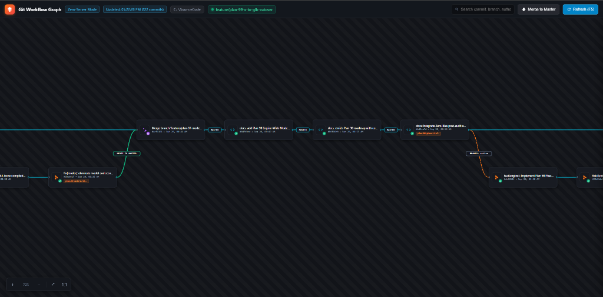

# ⚡ n8n-git-ui: Git DAG Visualizer (Zero-Server Architecture)

[](https://skszone01.github.io/n8n-git-ui/)
[](LICENSE)
[](#zero-server-architecture)

> 🚀 **Live Interactive Demo:** [https://skszone01.github.io/n8n-git-ui/](https://skszone01.github.io/n8n-git-ui/)

<p align="center">
  
</p>

[English](#english) | [ภาษาไทย](#ภาษาไทย)

---

<a name="english"></a>
## 🌐 English

**n8n-git-ui** is a standalone, interactive Git Directed Acyclic Graph (DAG) visualizer built with an **n8n workflow-inspired design language**. It enables developers to explore complex Git topologies, branches, merges, and colorized unified diffs with zero backend servers, zero npm installations, and zero database dependencies.

### 🌟 Key Highlights

- **⚡ Zero-Server Architecture**: Runs directly in any modern web browser via `file://`, local file opening, or GitHub Pages. No Node.js, Docker, or web server daemon required.
- **🎨 n8n Workflow UI/UX**: Dark mode aesthetic, smooth Bézier curves, multi-lane branch rails, and interactive node cards representing commits and branches.
- **🛣️ Master Highway (Lane 0)**: Clean topological backbone centered on Lane 0, with upper lanes for merged feature milestones and lower lanes for ongoing feature branches.
- **🔍 Instant Search & Filtering**: Real-time fuzzy searching across commit hashes, commit subjects, authors, and branch names.
- **📑 Integrated Diff Drawer**: Click any commit node or WIP card to open a slide-out drawer with full commit metadata, file status badges (Added, Modified, Deleted), and syntax-highlighted unified diffs with line wrapping and clipboard copy.
- **🔨 Working Directory (WIP) Tracking**: Automatically detects uncommitted working tree changes (`git status --porcelain`) and renders an active WIP node connected to HEAD.
- **🗺️ Interactive Canvas Navigation**: Smooth pan, zoom (mouse wheel / touchpad), minimap preview, and one-click "Fit to View".

---

### 📂 Project Structure

```text
n8n-git-ui/
├── screenshot.png     # Visual preview of n8n workflow Git DAG
├── generate_dag.py    # Python CLI extractor that compiles git DAG & diffs into static JS
├── index.html         # High-performance Vanilla JS / HTML5 canvas visualizer
├── git_data.js        # Static data payload (window.GIT_DAG_DATA)
├── open_ui.bat        # One-click script: regenerate graph & launch in default browser
├── update_graph.bat   # Helper script to refresh git_data.js
├── .gitignore
├── LICENSE
└── README.md
```

---

### 🚀 Quick Start

#### Requirements
- **Git** (installed and available in `PATH`)
- **Python 3.8+** (standard library only, no pip dependencies required)

#### Option 1: Automatic Launch (Windows)
Double-click `open_ui.bat` or run:
```cmd
open_ui.bat
```
This extracts the latest commit history from your repository and opens `index.html` in your default browser.

#### Option 2: Command Line (Cross-Platform)
1. Run the Python generator:
   ```bash
   # From inside your target repository:
   python generate_dag.py

   # Or specify target repository path as argument:
   python generate_dag.py /path/to/your/git/repo
   ```
2. Open `index.html` in your browser:
   ```bash
   # Linux / macOS
   xdg-open index.html   # or open index.html

   # Windows
   start index.html
   ```

---

### ⌨️ Canvas Controls

| Action | Control |
| :--- | :--- |
| **Pan Canvas** | Click and drag on empty canvas background |
| **Zoom In / Out** | Mouse wheel scroll or Pinch gesture |
| **Select Commit** | Click any commit node card |
| **View Diff & Files** | Inspect right-side slide-out drawer |
| **Search Commits** | Click search box or press `Ctrl + F` / `/` |
| **Reset View** | Click `Fit to View` button in header |

---

<br/>

---

<a name="ภาษาไทย"></a>
## 🇹🇭 ภาษาไทย

**n8n-git-ui** คือเครื่องมือแสดงผลแผนผังเส้นทางและประวัติการพัฒนาของ Git (Git DAG Visualizer) ในรูปแบบ Canvas ผังโหนดสไตล์ **n8n Workflow** ที่สวยงาม เรียบหรู ใช้งานง่าย และทำงานแบบ **Zero-Server** (ไม่ต้องรันเซิร์ฟเวอร์, ไม่ต้องติดตั้ง npm packages, ดับเบิลคลิกเปิดไฟล์ `index.html` ดูได้ทันที)

### 🌟 จุดเด่นสำคัญ

- **⚡ สถาปัตยกรรม Zero-Server**: ทำงานผ่านไฟล์ HTML/JS แบบ Standalone 100% สามารถเปิดดูได้ทันทีผ่าน Browser หรือฝากโฮสต์บน GitHub Pages
- **🎨 สไตล์ n8n Canvas**: หน้าจอ UI แบบ Modern Dark Mode พร้อมสายเชื่อมโยง Bézier Curve แยกสีตาม Lane ของแต่ละ Feature Branch
- **🛣️ Master Highway (แกนกลาง Lane 0)**: จัดระเบียบเส้นทางกิ่งหลักไว้กึ่งกลาง เลนด้านบนสำหรับกิ่งฟีเจอร์ที่ Merge แล้ว และเลนด้านล่างสำหรับกิ่งที่กำลังพัฒนาอยู่
- **🔍 ระบบค้นหาแบบเรียลไทม์**: ค้นหา Commit SHA, ข้อความ Commit, ชื่อผู้เขียน, หรือชื่อ Branch ได้ทันทีขณะพิมพ์
- **📑 แผงดู Diff ในตัว (Slide Drawer)**: คลิกเลือก Commit เพื่อดูรายการไฟล์ที่เปลี่ยนแปลง พร้อมหน้าต่างโค้ด Diff แสดงไฮไลต์สีเขียว/แดง และปุ่มคัดลอก SHA/Path
- **🔨 ตรวจจับงานที่ยังไม่ Commit (WIP Detection)**: สแกน Working Directory อัตโนมัติ หากมีไฟล์ที่แก้ไขค้างอยู่ จะสร้างโหนด "WIP" แสดงต่อจาก HEAD ทันที
- **🗺️ ควบคุม Canvas อิสระ**: เลื่อน Pan, ซูมเข้า-ออก (Zoom In/Out), ย่อ-ขยายหน้าจอ และมีปุ่ม Fit to View ปรับมุมมองให้อยู่ในหน้าจอพอดี

---

### 🚀 วิธีการใช้งาน

#### สิ่งที่ต้องมีในเครื่อง
- **Git** (ติดตั้งและมีคำสั่งใน Terminal/Command Prompt)
- **Python 3.8 ขึ้นไป** (ใช้เฉพาะไลบรารีมาตรฐานที่ติดมากับไพธอน ไม่ต้อง `pip install` ใด ๆ ทั้งสิ้น)

#### วิธีที่ 1: รันแบบคลิกเดียว (Windows)
ดับเบิลคลิกที่ไฟล์ `open_ui.bat` ระบบจะดึงประวัติ Git ล่าสุดและเปิดหน้าเว็บให้ทันที

#### วิธีที่ 2: รันผ่าน Command Line
1. สั่งรัน Python เพื่อสร้างข้อมูลแผนผัง `git_data.js`:
   ```bash
   # หากรันในโฟลเดอร์ Repository:
   python generate_dag.py

   # หรือระบุ Path ของ Git Repository ปลายทาง:
   python generate_dag.py C:/path/to/repo
   ```
2. ดับเบิลคลิกเปิดไฟล์ `index.html` บนเบราว์เซอร์ (Chrome, Edge, Firefox, Brave ฯลฯ)

---

### 📄 สัญญาอนุญาต (License)

โปรเจกต์นี้เผยแพร่ภายใต้สัญญาอนุญาต **[MIT License](LICENSE)** สามารถนำไปใช้งาน ปรับแต่ง และพัฒนาต่อยอดได้อย่างอิสระ
